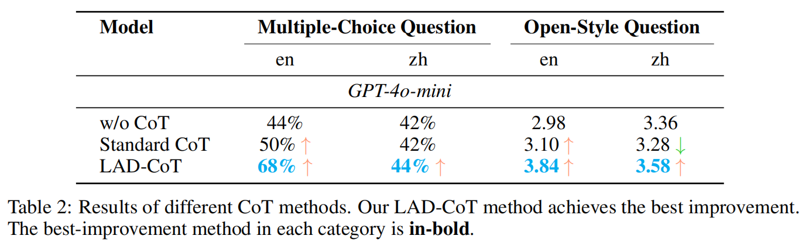
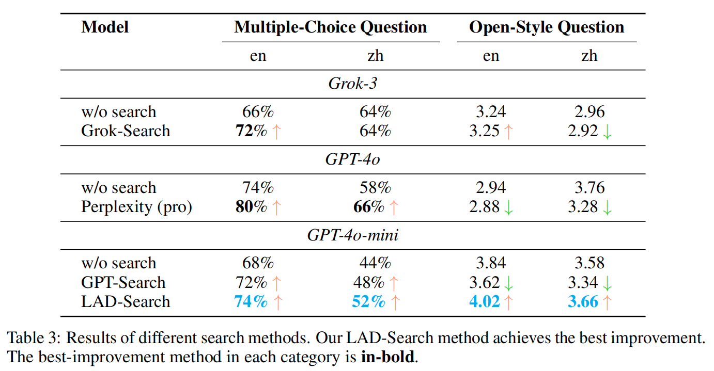

# Let Androids Dream of Electric Sheep

**Let Androids Dream (LAD) of Electric Sheep: A Human-like Image Implication Understanding and Reasoning Framework**

## 🔥News

- **[May. 2025]**: Our code and dataset have been released!

## Introduction

Metaphorical comprehension in images remains a critical challenge for AI systems, as existing models struggle to grasp the nuanced cultural, emotional, and contextual implications embedded in visual content. 
While multimodal large language models (MLLMs) excel in basic Visual Question Answer (VQA) tasks, they struggle with a fundamental limitation on image implication tasks: contextual gaps that obscure the relationships between different visual elements and their abstract meanings. 
Inspired by the human cognitive process, we propose ***Let Androids Dream (LAD)***, a novel framework for image implication understanding and reasoning. 
LAD addresses contextual missing through the three-stage framework: (1) **Perception**: converting visual information into rich and multi-level textual representations, (2) **Search**: iteratively searching and integrating cross-domain knowledge to resolve ambiguity, and (3) **Reasoning**: generating context-alignment image implication via explicit reasoning.
Our framework with the lightweight GPT-4o-mini model achieves SOTA performance compared to 15+ MLLMs on English image implication benchmark and a huge improvement on Chinese benchmark, performing comparable with the GPT-4o model on Multiple-Choice Question (MCQ) and outperforms 36.7% on Open-Style Question (OSQ). Additionally, our work provides new insights into how AI can more effectively interpret image implications, advancing the field of vision-language reasoning and human-AI interaction.

## Method


### Stage I: Perception

* Extract Image Description
* Summarize Keywords
  
Please run the [LAD](LAD_code.ipynb) (Stage I) code.

### Stage II：Search

* Construct Search Questions
* Self-judge
* ModelSearch
* WebSearch
* Rank
* Summary

Please run the [LAD](LAD_code.ipynb) (Stage II) code.

*Note: To setup WebSearch, please refer to [LAD-WebSearch](LAD-WebSearch/README.md) for more details.*

### Stage III：Reasoning

* Construct Reasoning Format
* Explicit Reasoning

Please run the [LAD](LAD_code.ipynb) (Stage III) code.

### LAD Pipeline

To get a clear understanding of the LAD pipeline, we provide a simple example code to illustrate the process. Please refer to the [LAD_pipeline_example](LAD_pipeline_example.py) for more details.


## Evaluation

Our evaluation utilizes two comprehensive image implication benchmarks, [II-Bench](https://github.com/II-Bench/II-Bench) and [CII-Bench](https://github.com/MING-ZCH/CII-Bench), both featuring **Multiple-Choice Question (MCQ)**. 
Furthermore, we manually construct a high-quality benchmark by randomly selecting 50 images from varied image types like illustrations and comics. And we measure accuracy by comparing the model's selected option to the ground truth. 

Aware of potential MCQ biases and the greater difficulty of generation over judgment tasks, we introduce a novel evaluation method **Open-Style Question (OSQ)**. 
It uses the same images with the fixed question: "What is the implication in this image?". And we use GPT-4o with a specialized evaluation metric as evaluators, validated by multiple human consistency checks. 

### Multiple-Choice Question (MCQ)

Our high-level benchmark includes diverse images such as comics, posters, illustrations, English and Chinese Internet memes, and Chinese traditional artworks, all rich in visual information and cultural significance. Each image is paired with one question, each offering six options with only one correct answer. The question is "What is the implication in this image?" (mostly) or different levels of image understanding, such as overarching interpretation and nuanced details.


### Open-Style Question (OSQ)

Our evaluation metric encompasses five key perspectives: ***Surface-level Information***, ***Emotional Expression***, ***Domain and Context***, ***Rhetorical Skills***, and ***Deep Implications***.


## Experiments

### Full Results


### Ablation Study

#### LAD-CoT: Stage I (Perception) & Stage III (Reasoning)



#### LAD-Search: Stage II (Search)



## Citation

If you find our work helpful in your research, please cite the following paper:

```

```

## Acknowledgments

* [II-Bench](https://github.com/II-Bench/II-Bench): An English Image Implication Understanding Benchmark for Multimodal Large Language Models ***(NeurIPS 2024)***
* [CII-Bench](https://github.com/MING-ZCH/CII-Bench): Can MLLMs Understand the Deep Implication Behind Chinese Images? ***(ACL 2025)***

